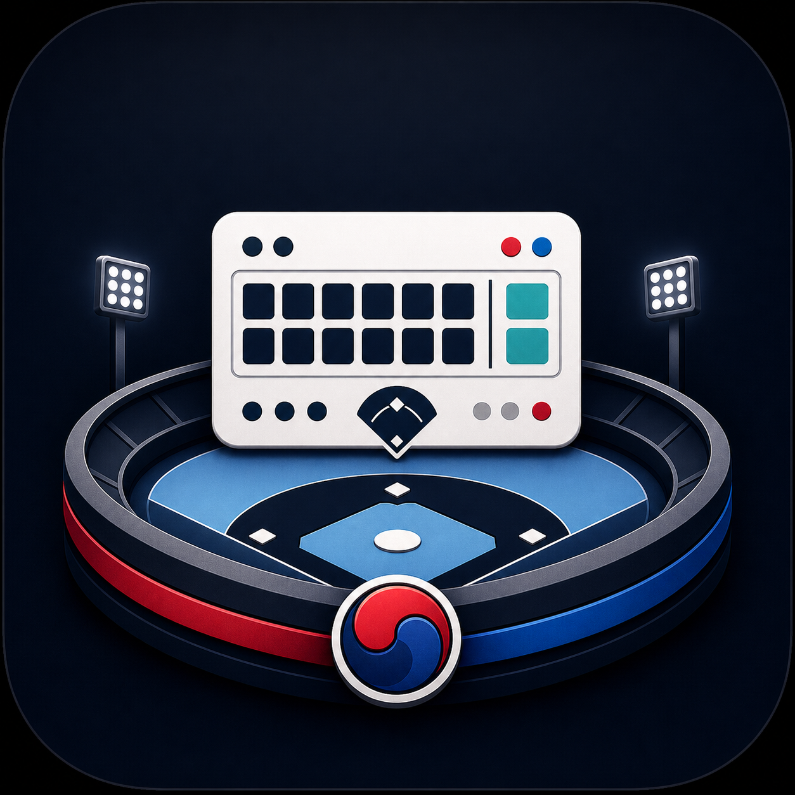
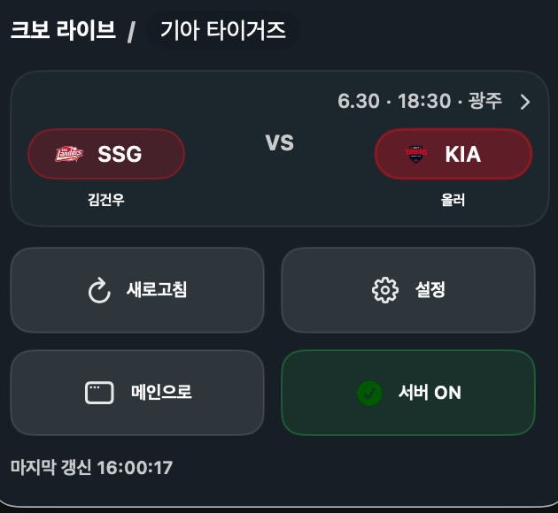
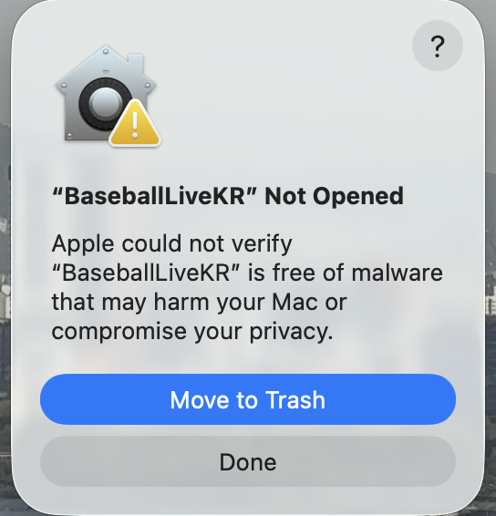
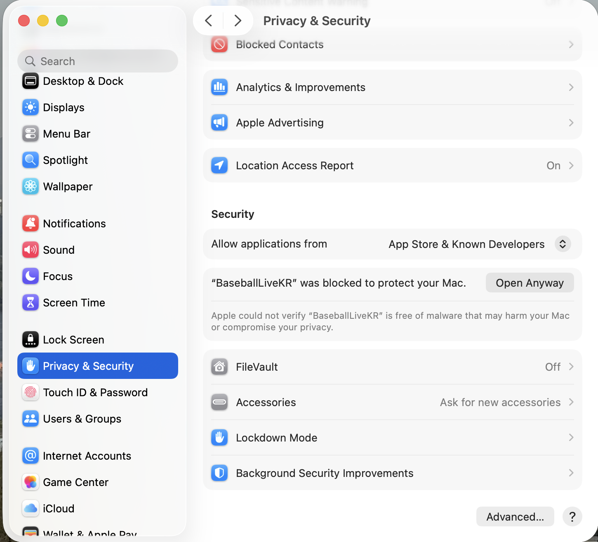

# Baseball LIVE KR

<p align="center">
  
</p>

<p align="center">
  <b>한국어</b> · <a href="README.en.md">English</a>
</p>

Baseball LIVE KR은 야구 중계를 계속 켜두지 않아도 지금 경기가 어떻게 흘러가는지 확인할 수 있는 앱입니다. 위젯, 라이브 액티비티, 메뉴바처럼 늘 보이는 자리에 오늘의 KBO 경기 실황을 띄워, 점수 변화와 응원팀의 흐름을 앱을 열지 않고도 바로 확인하는 것을 목표로 합니다.

현재는 macOS에서 메뉴바와 작은 창으로 경기 상황을 확인하는 경험을 먼저 다듬고 있습니다. 위젯과 라이브 액티비티를 포함한 iOS(iPhone) 버전은 이후 확장할 예정입니다.

## 지금 볼 수 있는 것

### 경기 확인

- 오늘 열리는 KBO 경기 목록과 경기별 점수 확인
- 진행 중 경기의 현재 상황과 이닝별 흐름 확인
- 경기 상세 화면에서 양 팀 분위기 따라가기

macOS 앱 메인 화면:


### 기록 보기

- 팀 순위와 주요 기록 확인
- 선수 검색과 시즌 기록 확인
- 응원팀을 더 빨리 찾도록 팀 로고와 워드마크 표시

### 편하게 따라보기

- 메뉴바에서 앱을 크게 열지 않고도 경기 요약 확인
- 화면을 자주 열지 않아도 바뀐 점수와 상황을 놓치지 않게

메뉴바에서 경기 확인:



## 앱 실행 방법

GitHub Releases에서 최신 `BaseballLiveKR-0.1.0-macOS.dmg`를 내려받습니다.

1. `.dmg` 파일을 열고, 왼쪽의 큰 `BaseballLiveKR.app` 아이콘을 오른쪽 `Applications` 폴더로 드래그합니다.
2. `Applications`에서 `BaseballLiveKR.app`을 엽니다.
3. 처음 열 때 "Apple에서 'BaseballLiveKR'에 멀웨어가 없음을 확인할 수 없습니다" 보안 경고가 나옵니다. 아직 Apple 공증(notarization)을 거치지 않은 빌드라서 나오는 정상적인 안내이며, 아래 순서대로 진행하면 이후에는 다시 묻지 않습니다.
   1. 경고 창에서 `완료`를 누릅니다. (`휴지통으로 이동`은 누르지 않습니다.)

      

   2. `시스템 설정` > `개인정보 보호 및 보안`을 열고 아래 `보안` 항목에서 `그래도 열기`를 누릅니다.

      

   3. 재확인 창에서 다시 `그래도 열기`를 누르고 관리자 암호 또는 Touch ID로 인증합니다.

   터미널이 편하다면 아래 한 줄로 같은 결과를 얻을 수 있습니다.

   ```bash
   xattr -d com.apple.quarantine /Applications/BaseballLiveKR.app
   ```

4. 메뉴바에서 Baseball LIVE KR 아이콘을 눌러 오늘 경기를 확인합니다.

## 개발 및 검증

자세한 개발, 검증, 배포 준비 명령은 `docs/dev.md`에 모았습니다.

## 추후 계획

- 새 버전 알림과 업데이트 안내를 더 자연스럽게 만들기
- macOS 앱을 더 쉽게 내려받고 실행할 수 있도록 배포 과정 정리하기
- iPhone에서 오늘 경기와 관심 경기를 빠르게 보는 화면 만들기
- 위젯과 라이브 액티비티로 경기 흐름을 바로 확인하기
- 실제 경기 중에도 점수와 기록이 안정적으로 보이도록 데이터 품질 높이기
- 응원팀 중심으로 더 빠르게 경기 상황을 볼 수 있는 개인화 개선하기
